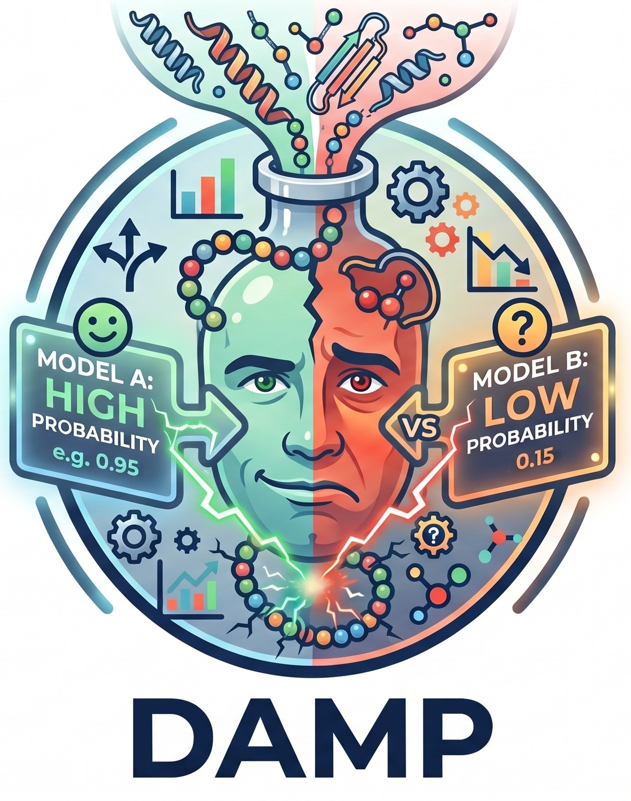

# Project DAMP: 

DAMP : Disagreements amongst AMP Model Predictions

Goal: To understand the nature of disagreements between SoTA AMP (antimicrobial peptides) classification and MIC regression models
